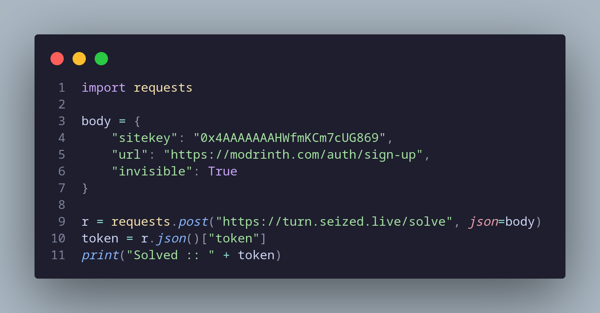
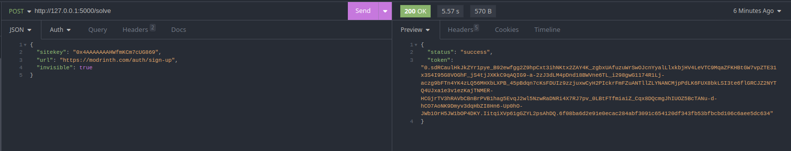

# turnaround-api  
Cloudflare turnstile solver API, based on [turnaround](https://github.com/Body-Alhoha/turnaround). Made using Python & flask  
*Public instance is no longer active

# Sponsor

Since I don't really mantain this repo anymore, if you need something reliable you should try out CapSolver

## Example  
Python code example [here](https://github.com/Euro-pol/turnaround-api/blob/main/example.py)

## Installing  
First, install the requirements:  
```bash
pip install -r requirements.txt
```
If it's your first time running playwright or you're using a virtual environment, you'll need to install the playwright browser:  
```bash
python -m playwright install
```
Then, run the server:  
```bash
python main.py
```
The server will be running on port 5000 by default, you can change it in main.py.

## Contributing  
Contributions are welcome, feel free to open a pull request or an issue

## Images  


 

## Credits  
[turnaround](https://github.com/Body-Alhoha/turnaround/) for the original solver
